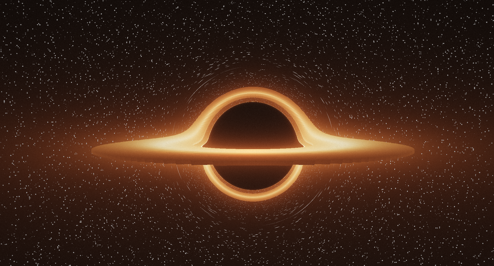

# GLSL Black Hole Simulation 🪐🕳

    
    

A real-time rendering of a Schwarzschild Black Hole, built using **Ray Marching** and **GLSL**.
> 😁 **Just for Fun:** This is a project created purely for experimentation and visual enjoyment. I'm exploring the math behind black holes, but I'm not a physicist—so expect some "artistic liberties" alongside the event horizons!

> ⚠️ **Disclaimer:** The code is currently **Work in Progress (WIP)** and subject to changes.

## 🔭 Overview
The goal of this shader is to visually simulate relativistic physics to achieve a cinematic and physically plausible look within a fragment shader. 

## 🛠️ Tech Stack
* OpenGL / GLSL fragments
---