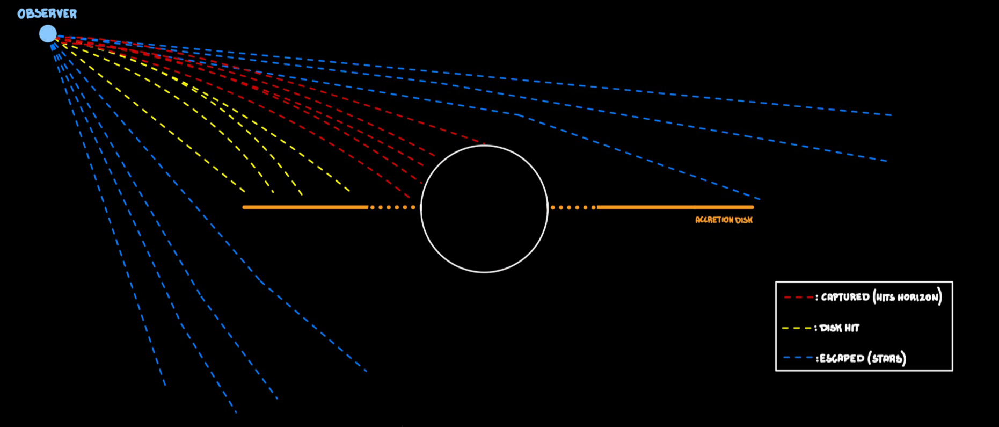

# Black Hole GLSL Simulation 🪐🕳
This repository features a physically-inspired, real-time simulation of a Schwarzschild Black Hole and its accretion disk. Developed as a single-pass GLSL fragment shader.
<p align="center">
  
  
</p>

> 😁 **Just for Fun:** This is a project created purely for experimentation and visual enjoyment. I'm exploring the math behind black holes, but I'm not a physicist, so expect some "artistic liberties" alongside the event horizons!

## 🚀 Overview
The simulation visualizes how extreme gravity warps space and time. Rather than using static textures, every visual element from the bending of starlight to the turbulent flow of the accretion disk is calculated dynamically on the GPU.

### Key Features

* **Gravitational Lensing:** light rays from the background stars are bent by the black hole's mass, creating a characteristic distortion field.

* **Relativistic Beaming:** the accretion disk exhibits an asymmetric brightness; gas moving toward the observer appears significantly brighter and more energetic.

* **Gravitational Redshift:** as light escapes the deep gravitational well, it loses energy, shifting its color toward deeper reds near the Event Horizon.

* **Procedural Accretion Disk:** turbulence and gas patterns are generated using multi-octave Flow Noise and Domain Warping.
---
## ⚡ How it Works: The Logic of Curved Spacetime
This diagram illustrates the actual physical simulation performed by the shader. Virtual photons are fired from the observer's camera, and their paths are continuously bent by the black hole's extreme gravity.


Based on their intricate curved trajectories, the rays meet one of three fates:

* **🔴 Captured Rays:** Their path is bent so violently that they spiral into the Event Horizon ($d < 1.0 \ R_s$), resulting in darkness.
* **🟡 Disk Rays:** They intersect the thin equatorial plane of the accretion disk ($2.2 < d < 8.0 \ R_s$), accumulating light and turbulent details from the plasma.
* **🔵 Escaping Rays:** They are deflected by the gravitational lens but manage to escape into deep space ($d > 50.0$), revealing the background starfield.
---

## 🔬 Mathematical Implementation
To achieve real-time performance, the simulation approximates General Relativity equations:
1. **Gravitational Lensing (Light Bending):** the ray direction ($rd$) is updated at each step based on the distance ($d$) from the center:
    
    $$rd_{new} = normalize(rd + normalize(-p)\cdot \frac{G}{d^2}) $$
    
    **Note:** $G$ is the gravitational constant (set to $0.05$ in the source) and $p$ represents the ray's current position.

2. **Accretion Disk Physics:** the disk is defined as a thin volumetric plane between $2.2$ and $6.0$ Schwarzschild radii ($R_s$).
   * <u>Velocity Field:</u> gas rotation follows an angular velocity proportional to $\frac{1}{d}$.
   
   * <u>Time Dilation:</u> time is not absolute; it slows down in the presence of strong gravitational fields. In this simulation, this effect is used to slow the motion of the accretion disk gas as it approaches the Event Horizon:
     
     $$t_{local}=t_{obs}\cdot \sqrt{1.0-\frac{1.0}{d}}$$
        
      Where:
        - **$t_{local}$ (Proper Time):** the "local" clock experienced by the gas at a specific distance from the black hole. In the shader, this value scales the procedural flowNoise: a lower $t_{local}$ results in slower, "frozen" animations as the gas nears the horizon.
        - **$t_{obs}$ (Coordinate Time):** the time measured by a distant observer (at infinity). This corresponds to the `u_time` uniform passed from the CPU, representing the total elapsed time since the simulation started.
        - **$d$ (Radial Distance):** the Euclidean distance from the current point to the center of the singularity.
        - **$R_s = 1.0$ (Schwarzschild Radius):** the simulation is normalized so that the Event Horizon lies exactly at $1.0$ unit from the center.
     >  **🔭 Physical Meaning:**
     > 
     > * At infinity ($d\rightarrow \infty$): $t_local$ is equal to $t_{obs}$, and the gas moves at its standard speed.
     > * At the Event Horizon ($d\rightarrow 1.0$): $t_{local}$ becomes $0$. To a distant observer, the gas appears to freeze in time right before crossing the horizon.

3. **Relativistic Beaming:** brightness is modulated based on the dot product between the ray direction and the gas velocity vector to simulate the "_Searchlight Effect_":
    
     $$I_{boost}= (1.0+rd\cdot v_{gas})^{3.5} $$
    
    Where:
    - **$I_{boost}$ (Intensity Multiplier):** the final factor applied to the base color of the gas. It scales the brightness of the disk based on its relative motion.
    - **$rd$ (Ray Direction):** the normalized vector representing the direction of the light ray coming from the camera. 
    - **$v_{gas}$ (Gas Velocity):** the tangential velocity vector of the gas at a specific point in the disk. In the code, this is calculated using the cross product:
   
        ```c++
        normalize(cross(vec3(0.0, 1.0, 0.0), p))
        ```

    >  **🔭 Physical Meaning:**
    >
      > * **Approaching Gas:** the light is blueshifted and compressed, resulting in an exponential boost in brightness.
      >
      > * **Receding Gas:** the light is redshifted and dimmed, causing that side of the disk to appear dark.
      >
      > * **The "1.0" Offset:** this prevents the intensity from dropping to zero.
---
## 🛠 Project Constraints & Limitations
- **Non-Kerr Metric:** this simulation models a non-rotating (Schwarzschild) black hole; frame-dragging (Kerr metric) is not currently implemented.

- **Adaptive Ray-marching:** we use a distance-based step size to optimize performance, utilizing Dithering to mitigate potential banding artifacts.

- **Volumetric Fog:** the "glow" is implemented as a screen-space accumulation rather than a full 3D volumetric fluid simulation.
---
## 🎮 Cinematic Scenarios
The system includes 5 pre-configured camera paths controllable via the `u_scenario` uniform:

1. **Standard:** lateral equatorial view.

2. **Zoomed:** high-magnification view of the Event Horizon.

3. **Polar:** a static bird's-eye view from the North Pole ($y=45$).

4. **Free-fall:** a dramatic, accelerated approach towards the singularity.

5. **Orbit:** a complete 360° hemispherical orbit Passing over the poles.
---
## 🎥 Qualitative results
<p align="center">
  
  
</p>
<p align="center">
  <em style="display: inline-block; width: 48%;">Scenario 1</em>
  <em style="display: inline-block; width: 48%;">Scenario 2</em>
</p>

<p align="center">
  
  
</p>
<p align="center">
  <em style="display: inline-block; width: 48%;">Scenario 3</em>
  <em style="display: inline-block; width: 48%;">Scenario 4</em>
</p>

<p align="center">
  
  
</p>
<p align="center">
  <em style="display: inline-block; width: 48%;">Scenario 5</em>
  <em style="display: inline-block; width: 48%;">Scenario 6</em>
</p>


<div align="center">
  <div style="display: inline-block; width: 48%; vertical-align: top;">
    
    <p><b>Scenario 6: Deep Space</b><br>
    <i>Distant static view of the lensing effect</i></p>
  </div>

  <div style="display: inline-block; width: 1%;"></div>

  <div style="display: inline-block; width: 48%; vertical-align: top;">
    
    <p><b>Scenario 4</b><br>
    <i>Dramatic zoom toward the event horizon</i></p>
  </div>
</div>


---
## 🚀 Try it Yourself
Want to navigate the event horizon on your own machine? You can run the simulation and switch between different cinematic scenarios.
### 1. Prerequisites
To compile and run the project, ensure you have:
- A C++ compiler (GCC, Clang, or MSVC).

- GLFW and GLEW/Glad for OpenGL context and window management.

- A GPU that supports OpenGL 3.3 core or higher.
### 2. Quick Start
```bash
# Clone the repository
git clone https://github.com/tuo-username/tuo-repo.git

# Navigate to the directory
cd black-hole-simulation

# Compile and Run (example using g++)
g++ main.cpp -lGL -lGLEW -lglfw -o black_hole
./black_hole
```
### 3. Interactive Scenarios
The shader includes 6 predefined camera scenarios. You can switch between them by changing the `u_scenario value in the code or via the integrated UI:

| Scenario | Description | Key Feature |
| :--- | :--- | :--- |
| **1 & 2** | Standard Orbit | High-quality cinematic view of the disk. |
| **3** | Top-Down View | Observe the accretion disk from a 45-degree angle. |
| **4** | The Descent | A dramatic zoom-in toward the event horizon. |
| **5** | Orbital Fly-by | A full 360-degree rotation around the singularity. |
| **6** | Deep Space | A distant, static view of the lensing effect. |

### 🧪 Experiment with the Physics
The real power of this project is its flexibility. Open the `fragment_shader.glsl` file and try tweaking these values to see how the physics change:

- **Change Gravity:** modify the gravity constant ($0.05$) to see how it warps the Einstein Rings.

- **Alter the Disk:** adjust the `innerEdge` and `outerEdge` in the accretionDisk function to resize the gas rings.

- **Time Warp:** change the speed of the disk by editing the localTime multiplier.

