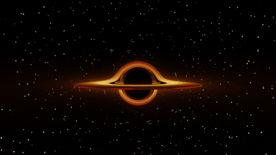

# GLSL Black Hole Simulation 🪐🕳

A real-time rendering of a Schwarzschild Black Hole (inspired by *Interstellar*), built using **Ray Marching** and **GLSL**.

> ⚠️ **Disclaimer:** This is a **personal hobby project** created for learning purposes. The code is currently **Work in Progress (WIP)** and subject to frequent changes.

## 🔭 Overview
The goal of this shader is to visually simulate relativistic physics to achieve a cinematic and physically plausible look within a fragment shader.

### ✨ Key Features implemented so far
* **Gravitational Lensing:** Real-time light deflection and space-time curvature using ray marching.
* **Volumetric Accretion Disk:**
    * **Geometric Flaring:** The disk is thin near the center and expands vertically outwards.
    * **Soft Density:** Exponential fade-off for a gaseous, non-polygonal look.
    * **ISCO:** Sharp cutoff at the Innermost Stable Circular Orbit.
* **Relativistic Light Physics:**
    * **Chromatic Doppler Effect:** Blueshift (hot/white) on the approaching side, Redshift (dim/red) on the receding side.
    * **Gravitational Redshift:** Light loses energy (reddening) as it climbs out of the gravity well.
* **Visual Fidelity:**
    * **Domain Warping Noise:** Simulates organic gas flows and magnetic striations.
    * **Cinematic Post-Processing:** ACES Tone Mapping, Chromatic Aberration, Film Grain, and Vignette.

## 🛠️ Tech Stack
* OpenGL / GLSL fragments
* Ray Marching with Adaptive Step Sizing (Anti-tunneling)

## 🚧 Roadmap
* Performance optimization.
* Refining the starfield background.
* Experimenting with Kerr (rotating) black hole metrics.
---